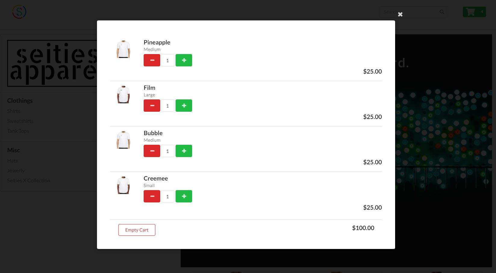
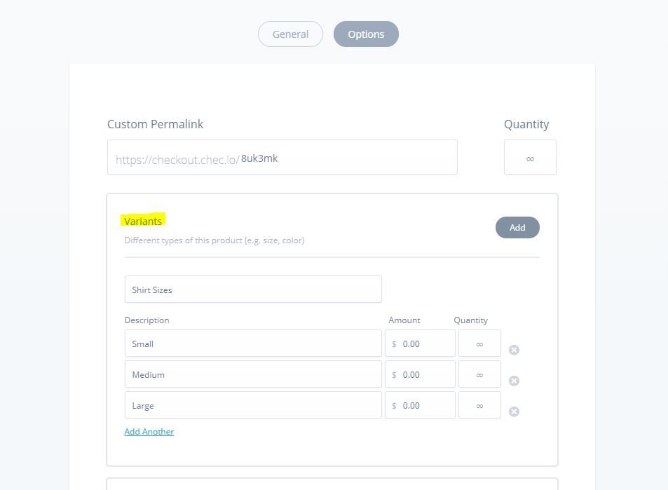
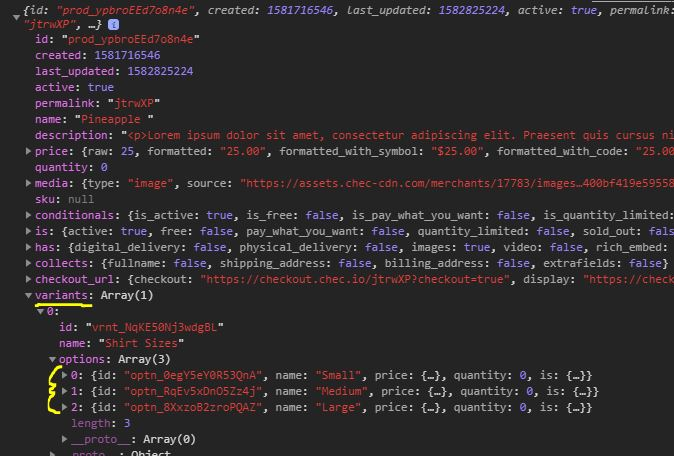
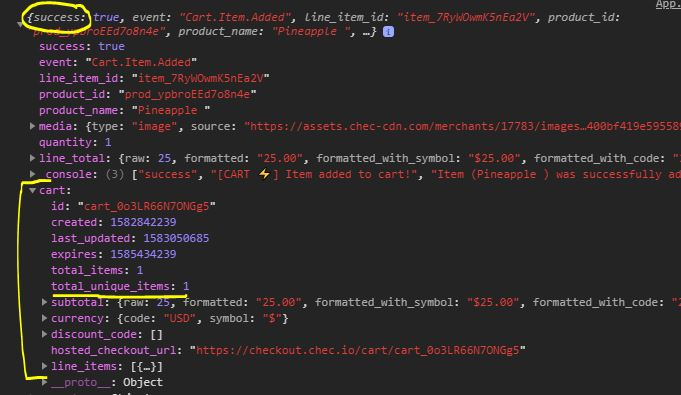

# Adding products to your cart using Commerce.js (SDK) and React.js

This guide illustrates how to add products to your cart using React.js & Commerce.js (SDK)

[See live demo here.](https://seities-store-cjs-react-guide.netlify.com/)

****** *Note* ******

* *This guide is using v2 of the SDK*
* *The Live Demo is best viewed on Desktop (**responsiveness limited**)*
* *This is a continuation of a previous guide - [Listing Products in Catalog](https://github.com/kingmoc/product-list-cjs-react)*

**********



## Overview
Okay! So you've been working hard adding all your wonderful products to your Chec dashboard.  Now it's time to give the user the ability to add those products to the cart.  This process involves a few more steps but don't worry - this guide has you covered! One of the biggest advantages of using the Commerce.js (SDK) is that the commerce object has easy to implement functions that help with building out the cart functionality.  Further and most importantly, every cart method such as `cart.add()`, `cart.retrieve()`, `cart.update()` return an updated cart object which helps keep our cart updated and persistent through a refresh.  Now, let's dive in!

#### This guide will cover: 

1. Setting up variants and handling that in code 
2. The process to add a product to your cart 
3. Making sure to give cart update notification to user 
4. Listing items that have been added to cart 
5. Adding a button to empty entire cart 
6. Capability to increase/decrease quantity from within cart

*This guide strictly utilizes functional react components and relies heavenly on react hooks.  The purpose of this guide is to show how you can use the SDK to build eCommerce functionality and not a true deep dive into react. There will be links to outside resources that can further explain certain react features.*

### Requirements/Prerequisites

- [ ] IDE of your choice (code editor)
- [ ] [NodeJS](https://nodejs.org/en/), or [yarn](https://classic.yarnpkg.com/en/docs/install/#windows-stable) → npm or yarn.
- [ ] Some knowledge of Javascript & React
- [ ] *Bonus* Using [React Hooks](https://reactjs.org/docs/hooks-reference.html) - specifically `useState()`, `useEffect()`, `useContext()`
- [ ] *Bonus* familiarity with the framework [Semantic UI (react) library](https://react.semantic-ui.com/)

## Getting Started

### STEP 1. Adding Variants:

This step is important when having products with some sort of variance.  If you have a product without variances, you can proceed to Step 2. - otherwise you need to add product variances in your Chec dashboard.  In our example store selling t-shirts most likely you'll have different sizes and colors.  To keep it simple we will be providing options of **Small, Medium, Large**. Once you click on a product, select the options tab ...   



It's important to note that you shouldn't add a price in this section unless a particular variant yields an increase in price. So in our case no matter which size you select, the price remains $25. Save those changes and see how we can handle this in our code! 

#### Handling Variants in the code

The Product object has a property *variants* which is an array with each product variant.  Also within each variant is another property *options* which is also an array with each variant options (ex. Small, Medium etc...) 



We can handle this data in our `<ProuductCard />` component where we are currently displaying product info. You can display the options how you like but our example will use a drop-down. Because of how drop-downs are configured with Semantic UI - we have to provide an options array of objects with a certain format. 

```javascript
    useEffect(() => {        
        
        let finalSizeArray = props.product.variants[0].options.map(option => {
            let sizeInfo = {}

            sizeInfo.key = option.name
            sizeInfo.text = option.name
            sizeInfo.value = option.id

            return sizeInfo
        })

        setSizes(finalSizeArray)
    }, [])
```

The purpose of the `useEffect()` here is that our `<Dropdown />` Semantic UI component needs options to select.  The `useEffect()` allows us to map through our variant options and create our options array before the render.  It's important to note I set the value to the option.id because that is important information needed to add a product (and it's variant) to the cart.  Once complete, we add that value to state so our `<Dropdown />`  component can then access it.  

```
const [sizes, setSizes] = useState([])
```

This is how our Product Card looks once we add our dropdown: 

```javascript
<Card>
    <Image src={props.product.media.source} />
    <Card.Content>
        <Card.Header>{props.product.name}</Card.Header>
        <Card.Meta>{props.product.price.formatted_with_symbol}</Card.Meta>
        <Card.Description>{props.product.description.replace(/(<([^>]+)>)/ig,"")}</Card.Description>
        <Dropdown
            className="sizes-drop"
            onChange={handleSize}
            value={sizes.text}
            fluid
            placeholder='Select Size'
            selection
            options={sizes}
        />
    </Card.Content>
</Card>
```

Now it's time to write the ***onChange*** function that will capture the selection and put that data into state: 

```javascript
const [variantInfo, setVariantInfo] = useState()

const handleSize = (e, {value}) => {
    setVariantInfo({[props.product.variants[0].id]: value})
}
```

This function creates an object that matches the proper format for sending variant info using the `cart.add()` method from the SDK. 
```
 { vrnt_RyWOwmPO9lnEa2: 'optn_zkK6oLpvEoXn0Q' }
 ```

 We now have an object variable (`variantInfo`) that contains the variantID along with the selected variant optionID.  


### STEP 2. Addding Product to Cart:

This is where the fun begins! Just a point of note, you're going to see a pattern emerge where we add an action button - write a function to handle said action, then pass that function to the component that needs it.  But before we do any of that, we need to setup the state that will be holding our cart object for the entire app.  

```
const [cart, setCart] = useState()
```

There are many ways to handle state management, which also includes organization.  For our example we will putting our 'global state' (*state that needs accessed across many components*) inside our `<App />` component.  For shallow nested components we will prop drill - for the deeply nested components we will use the `useContext()` API.  

Let's write our `addToCart()` function that will take two args - a *productId* and the *variantInfo* variable we talked about earlier:  

```javascript
const addToCart = (productId, variantInfo) => {

    if(variantInfo) {
        commerce.cart.add(productId, 1, variantInfo)
            .then(res => {
                setCart(res.cart)
            })
    } else {
        window.alert('Please Select a Shirt Size')
    }
}
```

We have some logic to make sure the user selects a variant (it's required to select a variant in order to add it to the cart). We also hard-code the quantity to 1 because our cart page is where a customer can change the quantity. Lastly upon a successful response we'll add the cart object to our global cart state. 

#### Utilization of `cart.retrieve()`

This is a very important method because when called it returns your most up to date cart info.  We want to use this method in our `<App />` component to always be checking for the latest cart data.  As you will see, this also helps us with data persistence in the event of a refresh or re-render.   

```javascript
useEffect(() => {
    commerce.cart.retrieve()
        .then(res => {
            setCart(res)
        })
},[])
```

Let's take a look at our `<App />` component with all the updates: 

```javascript
function App() {

    const commerce = new Commerce(process.env.REACT_APP_PUBLICKEY_SANDBOX)

    const [cart, setCart] = useState()

    useEffect(() => {
        commerce.cart.retrieve()
            .then(res => {
                setCart(res)
            })
    },[])

    const addToCart = (productId, variantInfo) => {

        if(variantInfo) {
            commerce.cart.add(productId, 1, variantInfo)
                .then(res => {
                    setCart(res.cart)
                })
        } else {
            window.alert('Please Select a Shirt Size')
        }
    }

    return (
        <div className="App">
            <Nav cart={cart} emptyCart={emptyCart}/>
            <Grid centered stackable padded relaxed>
                <Grid.Column className='left-column' width={5}>
                    <LeftPanel />
                </Grid.Column>
                <Grid.Column width={9}>
                    <ProductContainer 
                        addToCart={addToCart} 
                    />
                </Grid.Column>
            </Grid>
            <Footer />
        </div>
  );
}
```

We have our `cart.retrieve()` always making sure our cart object is up to date, our `addToCart()` function that is being passed to our `<ProductContainer />` component -  which will then be passed to our `<ProductCard />` component.  

#### Add to Cart Button

Now that we have everything setup in our <App /> component and have also passed the `addToCart()` function to the proper component - we need to create a button that will trigger our function and add the product (and its variant) to the cart and also update our state cart object. 

```javascript

const handleButtonAddCart = e => {
    e.preventDefault()
    props.addToCart(props.product.id, variantInfo)
}

<Button fluid className='add-button' onClick={handleButtonAddCart}>
    Add to Cart
    <Icon name='arrow right' />
</Button>
```

As you can see we call our `addToCart()` function with the two required args which then runs and executes letting us know a product has been added to our cart! 



### STEP 3. Add Cart Notification:

* ***TO BE CONTINUED ...***

### STEP 4. Displaying the Product Info:

We now have a variable `products` which is an array of objects and each object being a particular product. We want to to take that data a display it for the world to see! I choose to map of over the array and pass down each product data as a prop to the ProductCard component. 

```javascript
 return (
        <>
            <Grid stackable columns='equal' centered>
                <Image src={hero} fluid/>
                {products.map(product => <Grid.Column width={5} key={product.id}><ProductCard product={product} /></Grid.Column>)}
            </Grid>
        </>
    );
```

Here's a look at the ProductCard Component where I'm parsing the data I need for display: 

```javascript
const ProductCard = ({product}) => {
   
    return (
        <Card 
            image={product.media.source}
            header={product.name}
            meta={product.price.formatted_with_symbol}
            description={product.description.replace(/(<([^>]+)>)/ig,"")}
        />
    );
};
```

#### Conclusion 

Well there you have it.  A quick guide to getting your products to display using React.  As you can see, it doesn't take much to get some products listed on your site.  Commerce.js has done their best to make building an eCommerce site fun and easy.  I really hope this guide helps get you started with whatever project you hope build.

[LIVE DEMO](https://product-list-cjs-react.netlify.com/)

## Built With

* [React.Js](https://reactjs.org/docs/getting-started.html)
* [Semantic-UI](https://react.semantic-ui.com/)


