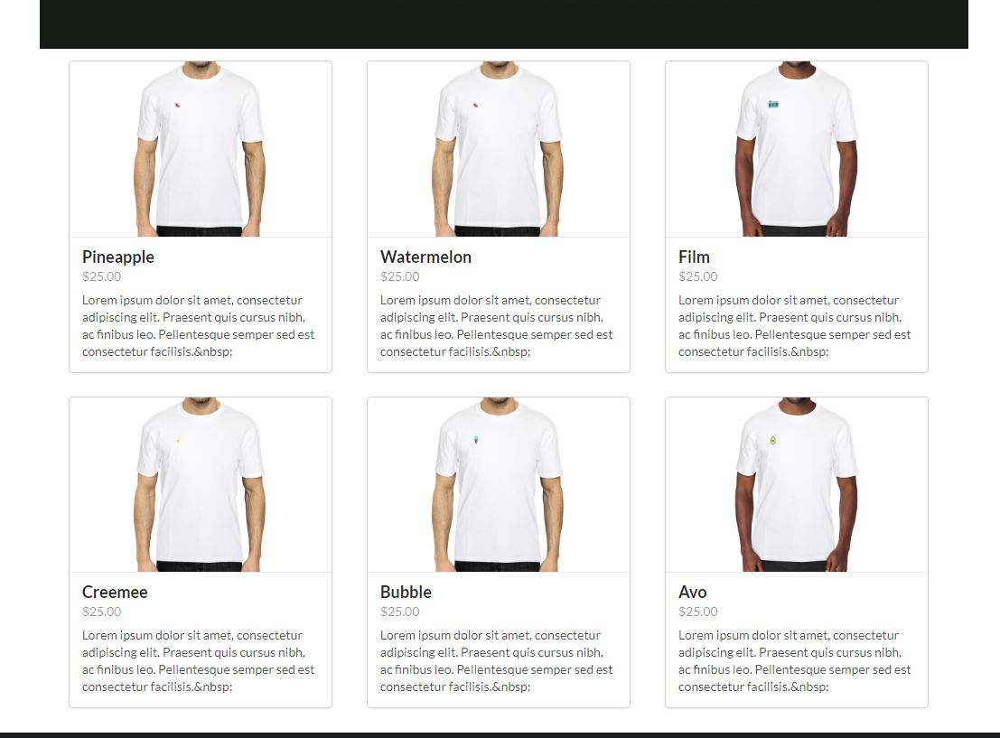
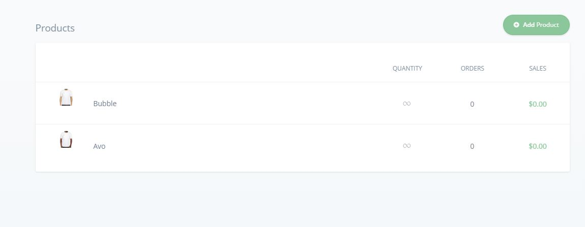

# Listing Products in a Catalog using Commerce.js (SDK) and React.js

A quick guide that shows you how to display a list of products using React.js & Commerece.js (SDK)

*Note: This guide is using v2*



## Overview
The point of this guide is to help developers get familiar with using the Commerce.js SDK in conjunction with React.  Commerce.js is a powerful tool/resource that gives you the ability to build custom ecommerce sites without the headache of building out a lot of the complex functionality that comes along with ecommerce.  This means less experienced developers or eager online entrepreneurs can use these tools and build a more controlled and customized online store without relying on the big players like Shopify. Let's dive in! 

#### This guide will cover: 

1. Adding Products to your chec dashboard
2. Using the Commerce.js SDK to access dashboard data
3. Implementing Commerce.js in a React App
4. Displaying a list of products on the screen

*This guide will not go into detail about other features/functionality within an ecommerce site such as: adding to cart, product page, checking out etc ... It will simply give a blueprint to how you can display a list of products specifically with React.* 

### Requirements/Prerequisites

- [ ] IDE of your choice (code editor)
- [ ] [NodeJS](https://nodejs.org/en/), or [yarn](https://classic.yarnpkg.com/en/docs/install/#windows-stable)
- [ ] Some knowledge of Javascript & React
- [ ] *Bonus* familiarity with the framework Semantic UI

## Getting Started

### STEP 1. Create an account and upload Product Info:

It should be noted that there are two main components, chec (dashboard) and commerce.js SDK.  Think of chec as the power, the source of all your customer data, transactions - things of that nature.  Think of the SDK as your way to communicate with your data.  You'll need to create an account [HERE](https://dashboard.chec.io/signup) - once logged in, navigate to products! The only product data you need to get started is: **Name, Image, Price, Description.** 



### STEP 2. React Time! (Getting your App setup):

This is where you fun begins!  This example was done using CRA ([create-react-app](https://create-react-app.dev/docs/getting-started/)).  If you're familiar with React, then you know all about CRA.  If you don't want to fire up a project from scratch, you can fork and clone this repository (make sure to navigate to the proper folder) and run: 

`yarn install or npm install`

This will install the necessary dependencies needed for this project.  This also includes the package needed for the commerce.js SDK. Once installed run `yarn start` to run the app using react's development server.  

##### Installing Commerce.js manually

One of the great things about this SDK is its ease of use.  Getting what you need into the project is very simple.

1. [Installing via CDN](https://commercejs.com/docs/overview/getting-started.html)

```
<script type="text/javascript" src="https://assets.chec-cdn.com/v2/commerce.js"></script>
```

2. [Installing via SDK](https://commercejs.com/docs/overview/getting-started.html)

```
npm install @chec/commerce.js
```

### STEP 3. Using Commerce.js in your Project:

Again, the developers at Commerce.js have done their best to make using this tool simple.  If you take a look in the product container component (product-list-cjs-react/src/components/ProductContainer.js) - this is where the magic happens! In order to connect to the source (your chec dashboard) you must first import the package: 
```
import Commerce from '@chec/commerce.js'
```
AND Then create your object variable ... 

```
const commerce = new Commerce('YOUR SANDBOX PUBLIC KEY')
```

#### Using the commerce object

Utilizing this object can be tricky in React (based on life cycle methods and how react renders components) because the commerce object actually is a promise.  In order to handle the promise you must use `.then()` and `.catch()` so that you can process the data.  I won't go to deep on promises and how you handle them, but in this case its acting like an API call.  Because of that we must wrap this promise into a useEffect - so that we can safely store our product info into state.  Using state (which is basically data storage) is a big part of React and if you look at this example - I'm storing the returned data from the promise into state. 

```javascript
const [products, setProducts] = useState([])

    useEffect(() => {
        const commerce = new Commerce('YOUR SANDBOX PUBLIC KEY')
        commerce.products.list()
          .then(res => {
            setProducts(res.data)
          })
          .catch(err => console.log(err))
    },[])
```
If you notice, the setProducts function updates our products variable with all the info from our chec dashboard. 

### STEP 4. Displaying the Product Info:

We now have a variable `products` which is an array of objects and each object being a particular product. We want to to take that data a display it for the world to see! I choose to map of over the array and pass down each product data as a prop to the ProductCard component. 

```javascript
 return (
        <>
            <Grid stackable columns='equal' centered>
                <Image src={hero} fluid/>
                {products.map(product => <Grid.Column width={5} key={product.id}><ProductCard product={product} /></Grid.Column>)}
            </Grid>
        </>
    );
```

Here's a look at the ProductCard Component where I'm parsing the data I need for display: 

```javascript
const ProductCard = ({product}) => {
    console.log(product, 'props from Container')
    return (
        // <Grid.Column width={5}>
            <Card 
                image={product.media.source}
                header={product.name}
                meta={product.price.formatted_with_symbol}
                description={product.description.replace(/(<([^>]+)>)/ig,"")}
            />
        // </Grid.Column>
    );
};
```

#### Conclusion 

Well there you have it.  A quick guide to getting your products to display using React.  As you can see, it doesn't take much to get some products listed on your site.  Commerce.js has done their best to make building an ecommerce site fun and easy.  I really hope this guide helps get you started with whatever project you hope build.

[LIVE DEMO](https://product-list-cjs-react.netlify.com/)

## Built With

* [React.Js](https://reactjs.org/docs/getting-started.html)
* [Semantic-UI](https://react.semantic-ui.com/)


