their# Creating a single page checkout using Commerce.js (SDK) and React.js

This guide explains the process and procedure to capture a checkout using React.js & Commerce.js (SDK)

[See live demo here.](https://seities-store-cjs-react-guide.netlify.com/)

****** *Note* ******

* *This guide is using v2 of the SDK*
* *The Live Demo is best viewed on Desktop (**responsiveness limited**)*
* *This is a continuation of a previous guide - [Adding products to your cart](https://github.com/kingmoc/adding-products-cart-cjs-react)*

**********

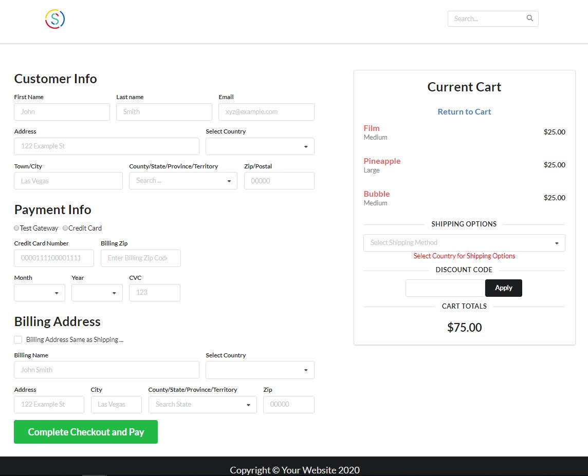

## Overview
You now have come to an important part of the eCommerce journey - payment processing and capturing an order.  And just a quick recap: I added products to the Chec Dashboard and listed them on the site, I was then able to add chosen products to the cart, and now I want those items in the cart to be processed - get customer information and finalize payment; all with Commerce.js and the SDK.  The order will then be added to your Chec dashboard along with customer info and other important data.  There's a lot of information packed in this guide, so let's dive in!   

#### This guide will cover: 

1. Create new shipping zone & add zone to product 
2. Add checkout button & setup route to checkout form 
3. Create Form
4. Handling Form Data/Validation/Errors 
5. Handling Discount Code
6. Capturing Checkout & route to Thank You page (*Thanks for Your Order*)

##### ***** *Extra* *****
How to implement Stripe as a payment gatway
*******
*This guide strictly utilizes functional react components and relies heavenly on react hooks and dynamic rendering.  The purpose of this guide is to show how you can use the SDK to build eCommerce functionality and not a true deep dive into react. There will be links to outside resources that can further explain certain react features.*

### Requirements/Prerequisites

- [ ] IDE of your choice (code editor)
- [ ] [NodeJS](https://nodejs.org/en/), or [yarn](https://classic.yarnpkg.com/en/docs/install/#windows-stable) → npm or yarn.
- [ ] Some knowledge of Javascript & React
- [ ] *Bonus* - Using [React Hooks](https://reactjs.org/docs/hooks-reference.html) - specifically `useState()`, `useEffect()`, `useContext()`
- [ ] *Bonus* - familiarity with [React Router](https://reacttraining.com/react-router/web/api/Route)
- [ ] *Bonus* - familiarity with [React Hook Form](https://react-hook-form.com/api/)
- [ ] *Bonus* - familiarity with [Stripe](https://stripe.com/docs)
- [ ] *Bonus* - familiarity with the framework [Semantic UI (react) library](https://react.semantic-ui.com/)

## Getting Started

### STEP 1. Creating Shipping Zone & Adding to Product:

One of the most important steps to capturing an order is determining the logistics of how you will ship your products.  You need to answer questions like: Where will I ship? How much will I charge? Will it be a flat fee to place A etc...

For this example, we will have 3 shipping zones: United States, Mexico, Canada.  I will be charging a flat rate (see below) for each zone and in order to set this up, you must navigate to the ***Shipping Tab*** within your setup and click **Add Zone**

<p align="center">
  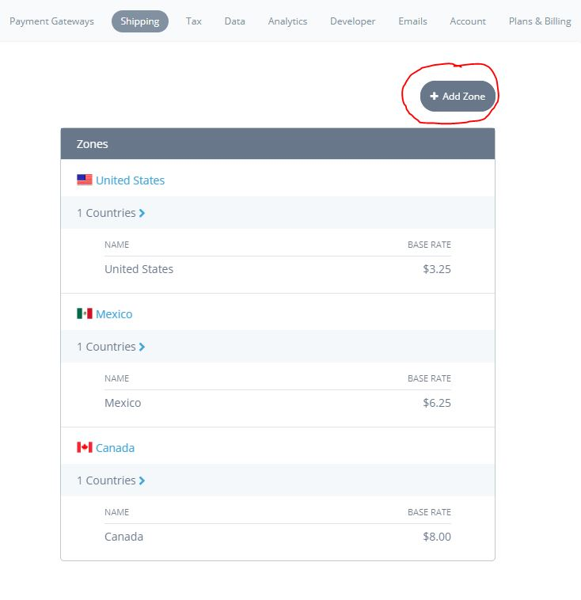
</p>

Now that I've added the shipping zones I wish to ship to, including price - I must further add these zones to my product.  Each product can have different shipping zones, but for simplicity I'm going to add all three zones to every product in the catalog. 

#### Add Zone to Product

Navigate to each individual product and click the enable zone button.  This will enable a particular shipping option for the product.  You can also add any extra shipping cost such as an amount for one order vs multiple.  

<p align="center">
  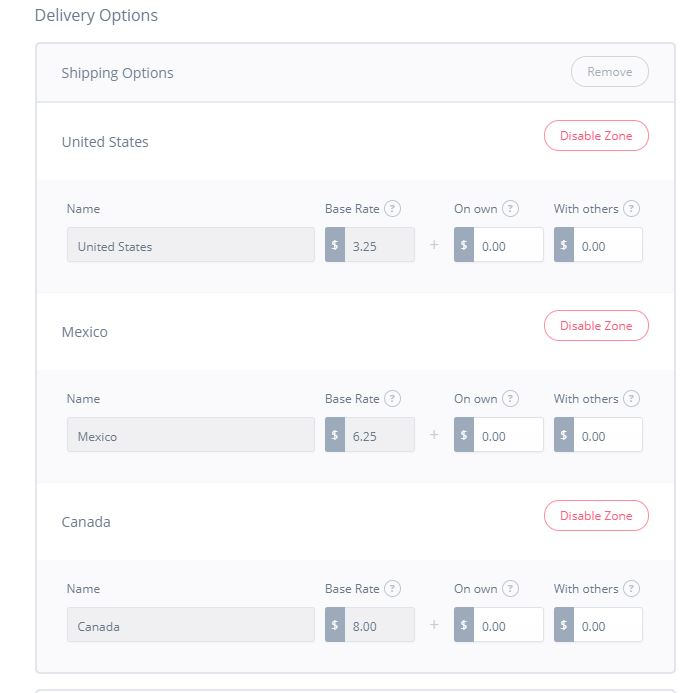
</p>

This is an important step and must be completed before you can capture a checkout. As you will see further in this guide, the shipping option is needed for Chec to process and finalize an order. You also want to give customers a shipping price so they have a total amount due. In our checkout form, once the customer chooses their country – the shipping options available for that country will be presented.  

### Step 2. Add Checkout Button & Setup Route to Form
<p align="center">
  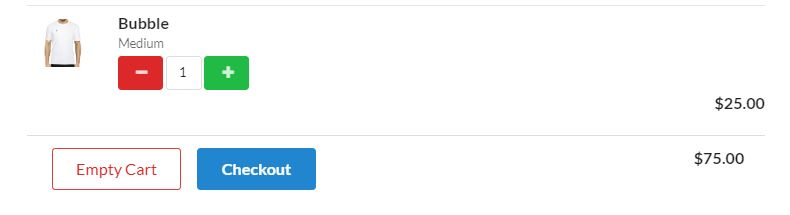
</p>

The next thing I need to do is add a checkout button to the cart modal where all my products are listed.  Adding the button is pretty straight forward, but this button will have an `onClick` which will call a function with a few triggers - one of them is routing to my checkout form.  

```javascript
// *** CartModal.js ***
<Button 
    floated='left' 
    size='big' 
    color='blue' 
    onClick={goToCheckout}
>
    Checkout
</Button>
```

```javascript
// *** CartModal.js ***
const goToCheckout = e => {
    history.push(`/checkout/${props.cart.id}`)
    localStorage.setItem('cart-id', props.cart.id)
    props.setModalOpen(false)
    props.setCheckout(true)
}
```

React Router has a history object that I use here to 'push' the customer to the page of your choice.  In this case to the checkout page.  I'm also adding the `cart_id` to the URL.  The `cart_id` is needed data for important SDK helper function calls, so adding it the URL makes it easy to access in the next component.  

I'm also adding the `cart-id` to local storage as trigger for the private route. Basically if there's no `cart-id` in local storage - you can't route to this page.  `props.setModalOpen(false)` is the trigger to close the modal and `props.setCheckout(true)` is the trigger to NOT show the cart icon in the Nav (*I want to hide the icon during checkout*). 

#### Setting up your Route

As previously mentioned, this is not a deep dive into React or React Router, but here's an overview on setting up some routes.  First I need to install the proper dependencies `react-router` & `react-router-dom`.  In the index.js file I need to import the BrowserRouter: 

```javascript
// *** index.js ***
import { BrowserRouter as Router } from "react-router-dom";

ReactDOM.render(
    <Router>
        <App />
    </Router>
,document.getElementById('root'));
```

I'm wrapping the `<Router>` component around the `<App />` component so everything in my `<App />` component can access any routes I setup.  All the routes for your app will be setup in the `App />` component.  If you take a look in the `App.js` you'll notice a `Route` import: 

```
import { Route } from 'react-router-dom'
```

This component will be used to render the `<CheckoutContainer>` component based on a few properties ... 

```javascript
// *** App.js ***
<PrivateRoute 
    component={CheckoutContainer}
    path={`/checkout/:id`} 
    setCheckout={setCheckout}
    setModalOpen={setModalOpen}
    setReceipt={setReceipt}
/>
```

*** *Note *** `<PrivateRoute />` (**check PrivateRoute.js**) is a Higher Order Component created as sort of a middleware to allow logic to determine where a cutomer is routed*

You will notice the [component prop](https://reacttraining.com/react-router/web/api/Route/component) which is set equal to the component that needs to be rendered.  The path is what the URL will be for this route, and the rest of the props are needed to be passed along to be used in the `<CheckoutContainer />` component.  Here's another route setup for the homepage:

```javascript
// *** App.js ***
<Route exact path="/" render={props => {
    return (
        <ProductContainer 
            {...props}
            addToCart={addToCart}
            setCheckout={setCheckout}
        />
    )
}}/>
```
Because this isn't a '*Private Route*' I use the [render prop](https://reacttraining.com/react-router/web/api/Route/render-func) which takes a function and returns your component.  So anytime a customer hits the home page, they will be routed to our `<ProductContainer />` component (*component that is listing my products*).  

If you recall for the checkout button I pushed the customer to this path: 
```
history.push(`/checkout/${props.cart.id}`)
```
And in App.js, I have a route setup to that exact path: 
```
<PrivateRoute 
    component={CheckoutContainer}
    path={`/checkout/:id`} 
```

the `:id` is just a foo name that is a variable for whatever text you put there.  In our case we're setting `props.cart.id` equal to `:id`.  This can later be accessed on the [match object](https://reacttraining.com/react-router/web/api/match) - `props.match.params.id`

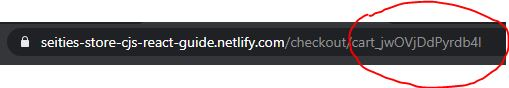

#### The `<CheckoutContainer />` Component

How you setup your React app and organize your components can vary.  I decided to have a `<CheckoutContainer />` component that will contain my form and other essential data necessary for checkout.  One of the most important features of the Commerce.js SDK is the checkout token.  The checkout token is your key or access to all the information needed to capture a checkout.  Further it has the live object which contains the most up date data in regards to items, shipping methods etc... [Read more about the Checkout Token](https://commercejs.com/docs/examples/capture-checkout.html)

In the `<CheckoutContainer />` component I will be generating the checkout token.  I will use the `commerce.checkout.generateToken()` helper function and wrap this in an `useEffect()`  - so that any time this component is loaded, I will always set the live object in state: 

```javascript
useEffect(() => {
    // *** CheckoutContainer.js ***

    /* *** Getting Checkout Token - Set Live Object in State *** */

    let cartId = props.match.params.id
    commerce.checkout.generateToken(cartId, { type: 'cart' })
        .then(res => {
            setLiveObject(res.live)
            setTokenId(res.id)
        })
        .catch(err => {
            console.log(err)
        })

    props.setCheckout(true)
},[])
```

The function takes the cartId (which is retrieved from the [match object](https://reacttraining.com/react-router/web/api/match) `props.match.params.id`) and a second object that tells the type.  I grab the checkout token in the response and store that in state along with the live object.  

Because the live object contains so much valuable data, I can build triggers for certain UI based on the data changes.  I also send this live object to my form in order to build the `line_items` object later needed for capture.  


Now that my routes are setup and I'm generating my checkout token - it is time to build your form! 

### Step 3. Create Form

Before you create your form, it's good to determine what data is needed in order to process an order.  There are four main properties needed: **Customer** (*name, email etc...*), **Shipping** (*address, country etc...*), **Payment** (*card info, payment gateway*), **Fulfillment** (*whatever shipping method was selected*). Head over to the [docs](https://commercejs.com/docs/examples/capture-checkout.html) to get a better look at the final object you'll be sending to the Chec dashboard.   

*** *Note *** There's also **Billing** but it holds the same 'sub-properties' as Shipping - so I have logic setup to only include **Billing** if the customer's billing address is different than their shipping.*

Each main property is an object which contains more properties 'sub-properties' of data that needs to be collected.  Take a look! 

```
customer: {
    firstname: 'Van',                   
    lastname: 'Williams',
    email: 'van.doe@example.com',
  },
  shipping: {
    name: 'Van Williams',
    street: '123 Fake St',
    town_city: 'Nashville',
    county_state: 'TN',
    postal_zip_code: '94103',
    country: 'US',
  }
```
I will be building my form using [Semantic UI](https://react.semantic-ui.com/collections/form/) components instead of the standard `<input />` element.  It is essentially the same implementation except you will see extra properties specific to the custom component provided by [Semantic UI](https://react.semantic-ui.com/).  Let's look at each main property: 

#### Customer

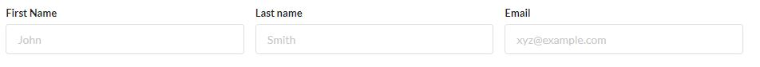

```javascript
// *** CheckoutForm.js ***
<Form.Input
    fluid
    name="firstname" 
    label='First Name'
    placeholder='John'
/>
<Form.Input 
    fluid 
    name='lastname' 
    label='Last name' 
    placeholder='Smith'
/>
<Form.Input 
    fluid 
    name='email'
    label='Email' 
    placeholder='xyz@example.com'
    type='email'  
/>
```

As you can see, the properties are the same like `name`, `placeholder` that you would use for a normal `<input />` element.  

#### Shipping

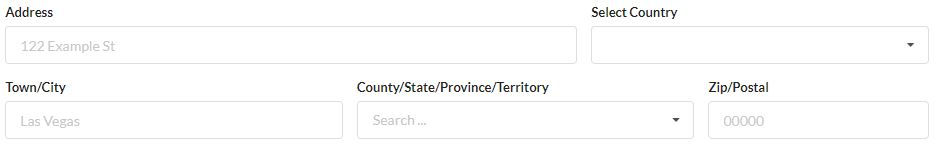

```javascript
// *** CheckoutForm.js ***
<Form.Group>
    <Form.Input 
        width={10} 
        name='street' 
        label='Address' 
        placeholder='122 Example St'   
    />
    <Form.Select
        width={6} 
        name='country' 
        label='Select Country' 
        options={countries}
    />
</Form.Group>
<Form.Group>
    <Form.Input 
        width={6} 
        name='town_city' 
        label='Town/City' 
        placeholder='Las Vegas' 
    />
    <Form.Select
        width={6} 
        label='County/State/Province/Territory' 
        placeholder='Search ...'
        name='county_state' 
        search 
        fluid
        options={getCountryInfoShipping()}
    />
    <Form.Input
        width={4} 
        type='number'
        name='postal_zip_code' 
        label='Zip/Postal' 
        placeholder='00000'
    />
</Form.Group>
```

For [dropdowns](https://react.semantic-ui.com/modules/dropdown/#types-search-selection-two) in Semantic UI there's an options prop that takes an array of objects of different options a customer can choose.  

```
// *** Countries.js ***

export const countries = [
    {
    value: "CA",
    text: "Canada"
    },
    {
    value: "MX",
    text: "Mexico"
    },
    {
    value: "US",
    text: "United States"
    }
]
```

As the store owner and for this example I already set up shipping for only three countries.  These will be the only choices a customer can choose in order to ship.  Once a customer chooses thier country it will trigger a different set of options based on that country.  In order to achieve this I compiled a list of all territories/states/provinces for each country (*see the North America folder under utils*).    

So, the options property for this dropdown ... 

```
// *** CheckoutForm.js ***

<Form.Select
    width={6} 
    label='County/State/Province/Territory' 
    placeholder='Search ...'
    name='county_state' 
    search 
    fluid
    options={getCountryInfoShipping()}
/>
```
is set to a function - this function checks what Country was selected and returns the proper array for that country: 

<p align="center">
  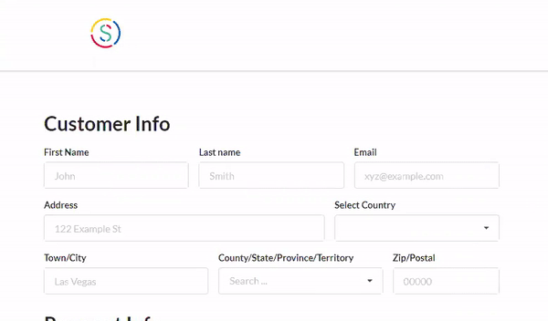
</p>

```
// *** CheckoutForm.js ***

const getCountryInfoShipping = () => {

    /* *** Gives user proper options based on Shipping Country *** */
    
    if (shipCountry === 'MX') {
        return mexico
    }

    if (shipCountry === 'CA') {
        return canada
    }

    if (shipCountry === 'US') {
        return stateOptions
    }
}
```

#### Payment

<p align="center">
  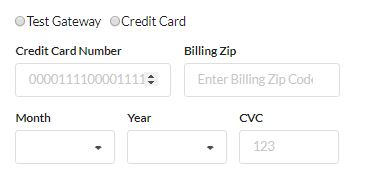
</p>

```javascript
// *** CheckoutForm.js ***
<Form.Group className='payment-radio'>
    <input
        name='gateway' 
        type='radio'
        value='test_gateway'
    />
    <label htmlFor="test_gateway">Test Gateway</label>
    <input
        name='gateway' 
        type='radio'
        value='stripe'
    />
    <label htmlFor="stripe">Credit Card</label>
</Form.Group>
<Form.Group>
    <Form.Input
        name='number'
        type='number' 
        label='Credit Card Number' 
        placeholder='0000111100001111' 
    />
    <Form.Input
        name='postal_billing_zip_code' 
        type='number'
        max='99999'
        label='Billing Zip' 
        placeholder='Enter Billing Zip Code'
    />
</Form.Group>
<Form.Group>
    <Form.Select 
        width={3} 
        name='expiry_month' 
        fluid 
        options={monthOptions} 
        label='Month' 
    />
    <Form.Select 
        width={3} 
        name='expiry_year' 
        fluid 
        options={yearOptions} 
        label='Year' 
    />
    <Form.Input 
        width={3} 
        name='cvc'
        type='number'
        label='CVC' 
        placeholder='123'
    />
</Form.Group>
```

These are all the fields needed to collect information about payment.  I had to bring in arrays (`monthOptions`, `yearOptions`) for the options props in regards to month/year card expiration.  

#### Fufillment

<p align="center">
  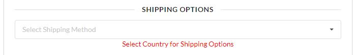
</p>

This is the last important piece of data you need to complete a checkout.  The customer needs to be able to select a shipping option.  The shipping option is determined by country - remember our shipping zones?  

**For example:** If the customer chooses Canada as their shipping country, then we run a function with that country code in order to give a shipping option to choose from.  This option determines the price for shipping to your country. For this store - I'm charging $8 dollars flate rate to ship to Canada.

Because I've separated the shipping options from the main form (*where I'm gathering all the other data*), I have to pass a function via props to our form.  This function is wrapped in a `useEffect()` and gets triggered every time a different country is selected.  

```
useEffect(() => {
    // *** CheckoutForm.js ***

    /* *** Takes the Shipping Country and updates shipping Options *** */
    props.getShippingOptions(shipCountry)
}, [shipCountry])
```

Let's take a look at the `getShippingOptions()` function: 

```javascript
// *** CheckoutContainer.js ***
const getShippingOptions = (countrySymbol) => {

    /* 
    Getting the Customer's Shipping Options based on the Country
    Function is triggered once user selects country in CheckoutForm. 
    */

    if (countrySymbol) {
        commerce.checkout.getShippingOptions(tokenId, {
            country: countrySymbol
        })
            .then(res => {
                let shippingOptionsArray = res.map(option => {
                    let shInfo = {}

                    shInfo.key = countrySymbol
                    shInfo.text = `${option.description}(${option.price.formatted_with_code})`
                    shInfo.value = option.id
        
                    return shInfo
                })
                setShippingOptions(shippingOptionsArray)
            })
            .catch(err => console.log(err))
    }
}
```

This function is using the `commerce.checkout.getShippingOptions()` [helper function](https://commercejs.com/docs/overview/getting-started.html) to go and retrieve the shipping option based on the country symbol (*I pass that data in as an argument*).  The response is an array of shipping options and I'm mapping over that array in order to format the data that gets passed to the options property in the selection dropdown element. I then put that array into state for later consumption. 

Here's a look at the code for the dropdown: 

```
<Dropdown
    placeholder='Select Shipping Method'
    fluid
    selection
    options={shippingOptions}
    onChange={handleDropDownShipping}
/>
```

The last part is that I want to apply the shipping option to the cart total and update the total cost.  The Commerce.js SDK makes this easy because they provide a function that when given a shipping option and a checkout token, you get back an updated live object.  All you have to do is update state with the new live object and all of the data depending on that object will get updated.  

```javascript
// *** CheckoutContainer.js ***

const handleDropDownShipping = (e, {value, options}) => { 
        
    /* 
    Applies shipping option to Cart Total
    Updates Live Object in state 
    */

    commerce.checkout.checkShippingOption(tokenId, {
        id: value,
        country: options[0].key
    })
        .then(res => {  
            setShipOption(value)
            setLiveObject(res.live) 
        })
        .catch(err => console.log(err))

}
```

As you can see I'm using `commerce.checkout.checkShippingOption()` helper function and passing it the checkout token and an object with the `shipping_option_id` and `country`.  As mentioned the response contains an updated live object so I update state and also set the `shipping_option_id` - (`setShipOption(value)`) in state so that info can be sent to the Chec dashboard for when I finally capture the checkout. 

<p align="center">
  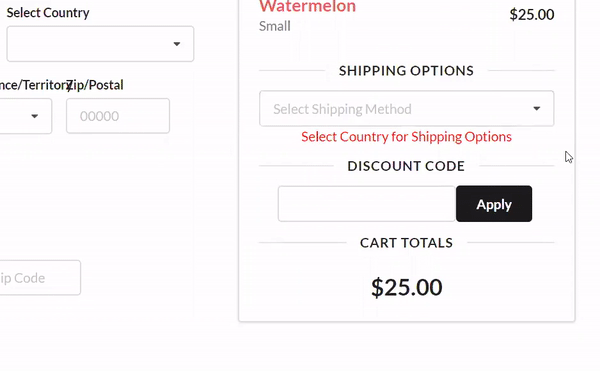
</p>

Yay! You have built your form and made sure you have all the fields necessary to capture an order.  You also confirmed that whenever a customer selects a country, they are then able to apply a shipping option to the total cost.  Now it's time handle all the data. 

### Step 4. Handling Form Data/Validation/Errors

Typically speaking at this point you would need to apply some `onChange` events to each of your inputs and dropdowns.  Then build a function that takes the input data and stores it into state.  After that you would probable write an `onSubmit` function to grab all the data in state and finally do something with it.  Within your `onSubmit` function is where you would handle errors and things of that nature.  

I am going to make your programming lives easier by using a third party library called [React Hook Form](https://react-hook-form.com/api/).  This is a form validation and form error handling library that makes the handling of data much easier.  When configured properly you don't have to apply change handler functions to each input and manually program errors in the event field data is missing.  

This is very important for UX (user experience) that the customer is informed visually if they left something blank or typed something incorrectly. I want to apply as much data validation as possible before sending data to be processed by Chec dashboard.  When programming our `onSubmit`function we know the data coming in has been validated.  

Let's add the dependency `npm install react-hook-form` or `yarn add react-hook-form`.  I will now bring in a component and a hook from the library: 

```
import { useForm, Controller } from 'react-hook-form'
```

*** *Note *** The power of this library is quite intense and this guide by no means explains this libarary in detail.  You may find another library for validation better such as formik or yup.  But this is a lightweight simple option for what we need to accomplish.*  

In order to configure everything properly we need to wrap our input elements with the `<Controller />`  component from `react-hook-form`.  We also will use a few helpful properties from within the `useForm()` hook: 

```
const { register, handleSubmit, errors, control, reset } = useForm()
```

[These properties and how they work further explained](https://react-hook-form.com/api#useForm) 

Let's take a look at some inputs to see how we configured them using `react-hook-form`: 

```javascript
// *** CheckoutForm.js ***
<Controller
    fluid
    id='customer' 
    name="firstname" 
    label='First Name'
    placeholder='John'
    control={control}
    as={Form.Input} 
    rules={{ required: "Please enter Firstname" }}
    error={errors.firstname && errors.firstname.message} 
/>
```

My input for getting firstname data now looks like this.  I used the `<Controller />` component from the library along with a few extra props.  The rules prop allows me to set rules for this input.  It takes an object with a property `required`.  It sets this input to be required and if left empty, an error gets added to the errors object based on the name.  Semantic UI has an error prop we can add and easily attach errors to any field left empty. 

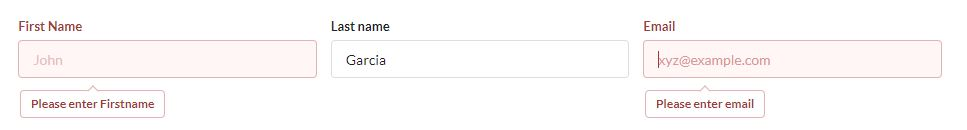

All the dropdown inputs will work slightly different in that need we to attach an `onChange` property that returns the selected option: 

```javascript
// *** CheckoutForm.js ***
<Controller
    fluid
    search 
    width={6} 
    label='County/State/Province/Territory' 
    placeholder='Search ...'
    name='county_state' 
    options={getCountryInfoShipping()}
    as={Form.Select}
    control={control}
    rules={{ required: "Must Select Country First" }}
    error={errors.county_state && errors.county_state.message} 
    onChange={(e) => e[1].value}
/>
```

It's a similiar process except we have the `onChange` that returns the value selected.

#### The `handleSubmit()` function

So I've wired up each input using the third party `react-hook-form` and made sure all the errors work properly.  Here comes the real power within the library if you recall the handleSubmit property that was brought in from the `useForm()` hook: 

```
const { register, **handleSubmit**, errors, control, reset } = useForm()
```

I will now pass my `onSubmit` function to the `react-hook-form`'s `handleSubmit()`: 

```
<Form className='checkout-form' onSubmit={handleSubmit(onSubmit)} loading={processing}>
```

Let's take a look at our function that we're passing to `handleSubmit()`. 

```
const onSubmit = (data) => {
    console.log(data)
}
```

As you can see there's an argument `data` that we will log and get some eyes on what is passed to our function.  You'll notice that all of the form data has been set as the value and each name set as the key.  

<p align="center">
  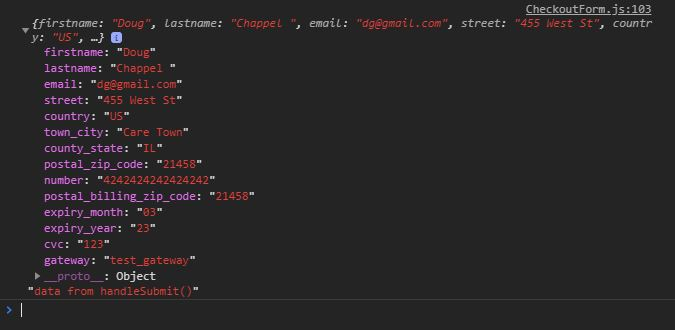
</p>

We have all the data from the form!  The convenient part is that this function never runs unless all input meets validation.  I set required to all inputs so this function ONLY runs if nothing is left blank.  All that is left is formatting the data properly to match how the Commerce.js SDK will process our data.  

### Step. 5 Handling Discount Code

One last quick procedure (*before we capture*) and that is handling a discount code. You must first add the discount code in your Chec dashboard. Navigate to discounts from the left-side menu and then click Add Discount: 

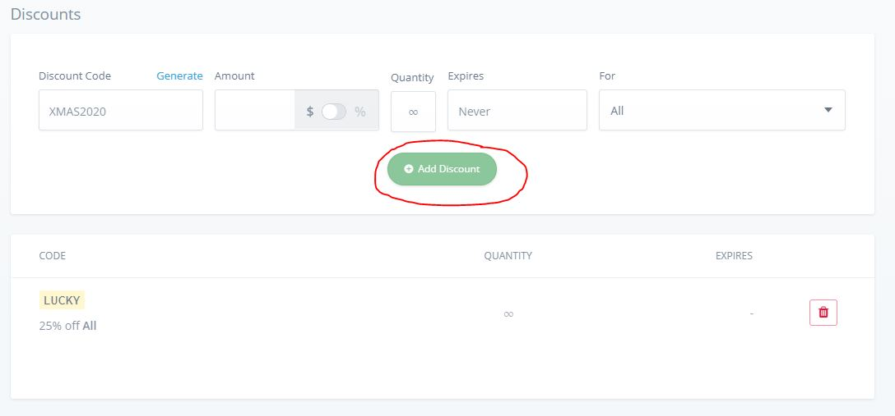

I will be setting one discount code and it will be **LUCKY**.  You have the option to apply the code to a particular product, but to keep it simple I will add the code to all products.  I now need to add an input and a button: 

```javascript
<form className='discount-code' onSubmit={handleDiscountClick}>
    <Input onChange={handleDiscountCode} />
    <Button color='black'>Apply</Button>     
</form>
```

As mentioned before in regards to selecting the shipping option - the discount code input is separate from our 'main' form (*no need for `react-form-hook` to handle one input*).  The input has a `onChange` that simply stores whatever is typed into state.  The `onSubmit` will take that text and try to apply the code.  

```javascript
// *** CheckoutContainer.js ***
const handleDiscountClick = (e) => {

    /* *** Checking to Make Sure Discount Code is Valid *** */

    e.preventDefault()

    if (!discountCode) {
        setNoDiscountCode(true)
        setInvalidDiscountCode(false)
    } else {
        commerce.checkout.checkDiscount(tokenId, {code: discountCode})
            .then(res => {  
                if (!res.valid) {
                    setInvalidDiscountCode(true)
                } else {
                    setInvalidDiscountCode(false)
                    setLiveObject(res.live)
                    setDiscountCode(null)
                }
                
                setNoDiscountCode(false)
            })
            .catch(err => console.log(err))
    }
}
```

I'm using the `commerce.checkout.checkDiscount()` which takes the checkout token and the discount code.  I have a few different state triggers setup to display different message depending on different outcomes. If no discount code is entered, the customer will see - "No Discount Code Entered".  The response of the function call has a property `valid`.  You can simply setup logic based off the `res.valid`.  If `res.valid` is true then you just update the live object with the updated live object that gets returned.  

<p align="center">
  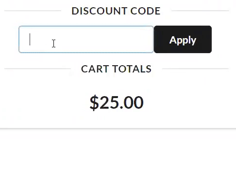
</p>

### Step 6. Capture Checkout / Route to Thank You Page

Now that all the data has been validated and we're able to access said data from the `data` object that gets passed to the `onSubmit` - let's format the data and get it ready for capture.  I want to revisit earlier in the guide before we built the form.  I mentioned the four main properties and how each property was set to another object with 'sub-properties'.  

You can reference the [Commerce.js](https://commercejs.com/docs/examples/capture-checkout.html) docs again to see what the shape of our data needs to be.  It appears as though I have all the data needed except the `line_items`.  Because I'm sending the live object to our form via props - we have access to the `line_items`.  I will utilize an `useEffect` here so that I ensure every time the form is rendered, I'm getting the latest items in our cart.  

```javascript
// *** CheckoutForm.js ***
useEffect(() => {

    /* 
        Takes Line Items from props and strutures the data 
        Object added to state   
    */

    let lineItems = {}

    props.liveObject.line_items.forEach(item => {

        lineItems = {
            ...lineItems,
            [item.id]: {
                quantity: item.quantity,
                variants: {
                    [item.variants[0].variant_id]: item.variants[0].option_id
                }
            }
        }
    })

    setLineItems(lineItems)

}, [])
```

I'm iterating through each item building the `line_items` property to match the SDK.  The nested object's key is the `item.id` (*`item` is each line item*) and the value is an object with `quantity` and `variants`.  Once our newly created `lineItems` object is built - I set that value in state.   

*** *Note *** I'm using `item.variants[0]` because as the store owner, I only created one variant.*

```
line_items: {
    // Key is the line item ID for our test product
    item_7RyWOwmK5nEa2V: {
      quantity: 1
      variants: {
        // Key is the variant ID for "Color", value is the option ID for "Blue"
        vrnt_bO6J5apWnVoEjp: 'optn_Op1YoVppylXLv9',
        // Key is the variant ID for "Size", value is the option ID for "Small"
        vrnt_4WJvlKpg7pwbYV: 'optn_zkK6oL99G5Xn0Q',
      }
    }

    https://commercejs.com/docs/examples/capture-checkout.html
```

You now have the last piece of data needed to finalize an order and capture a checkout. Let's put this all together and complete our `onSubmit()`: 

```javascript
// *** CheckoutForm.js ***
const onSubmit = (data) => {

    /* *** 
        Takes in all the data gathered from the Form
        Parses the data properly to match the shape for capture
    *** */

    setProcessing(true)

    let final = {}

    final.line_items = lineItems

    final.fulfillment = {
        shipping_method: props.shipOption
    }

    final.customer = {
        firstname: data.firstname,
        lastname: data.lastname,
        email: data.email
    }

    final.shipping = {
        name: `${data.firstname} ${data.lastname}`,
        street: data.street,
        town_city: data.town_city,
        county_state: data.county_state,
        postal_zip_code: data.postal_zip_code,
        country: data.country
    }

    if (!sameBilling) {
        final.billing = {
            name: data.billing_name,
            street: data.billing_street,
            town_city: data.billing_town_city,
            county_state: data.billing_county_state,
            postal_zip_code: data.billing_postal_zip_code,
            country: data.billing_country
        }
    }

    final.payment = {
        gateway: data.gateway,
        card: {
            number: data.number,
            expiry_month: data.expiry_month,
            expiry_year: data.expiry_year,
            cvc: data.cvc,
            postal_zip_code: data.postal_billing_zip_code,
        }
    }

    if (props.shipOption) {
        commerce.checkout.capture(props.tokenId, final)
            .then(res => {
                props.setReceipt(res)
                localStorage.removeItem('cart-id')
                setProcessing(false)
            })
            .catch(err => {
                window.alert(err.data.error.message)
                setProcessing(false)
            })
    }
    
}
```

Because the data object has everything needed, I can build the `final` object however necessary and pass that to the `commerce.checkout.capture()`. The last trigger that determines if a capture is run is the **`props.shipOption`** - this Boolean toggles true/false depending on if a shipping option is selected. So if there's no shipping option selected - the customer will NOT be able to complete their order.  

#### Route to Thank You page

The last step is routing the customer to a Thank You Page and I built the `<CheckoutComplete />` component to handle this.  One of the last layers of data validation comes from the Chec API.  The backend is setup to check U.S. zip codes based on the state and other error checking that comes in handy.  I set an alert box to display any messages from the backend.  If there are no errors I have a few triggers, but most importantly I'm pushing the customer to the `<CheckoutComplete />` page. 

```javascript
// *** CheckoutForm.js ***
commerce.checkout.capture(props.tokenId, final)
    .then(res => {
        props.setReceipt(res)
        localStorage.removeItem('cart-id')
        setProcessing(false)
        history.push(`/order-complete/${props.tokenId}/${res.id}`)
    })
    .catch(err => {
        window.alert(err.data.error.message)
        setProcessing(false)
    })
```

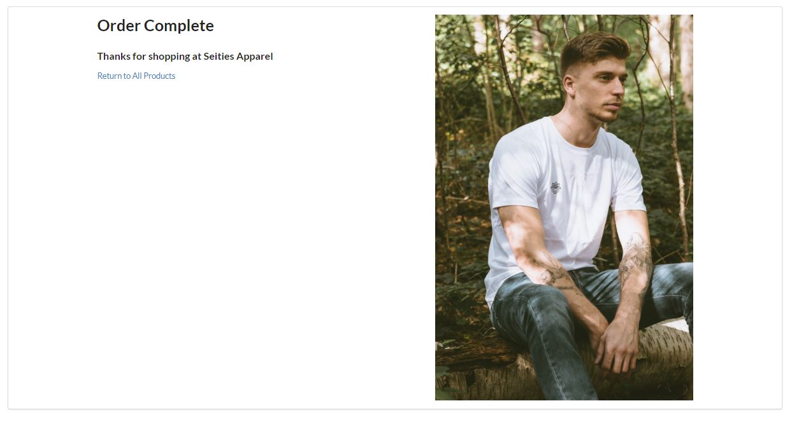

#### Locate Order in Dashboard

Once you complete a test order using the test gateway, navigate to your dashboard and find the order that was just placed.  

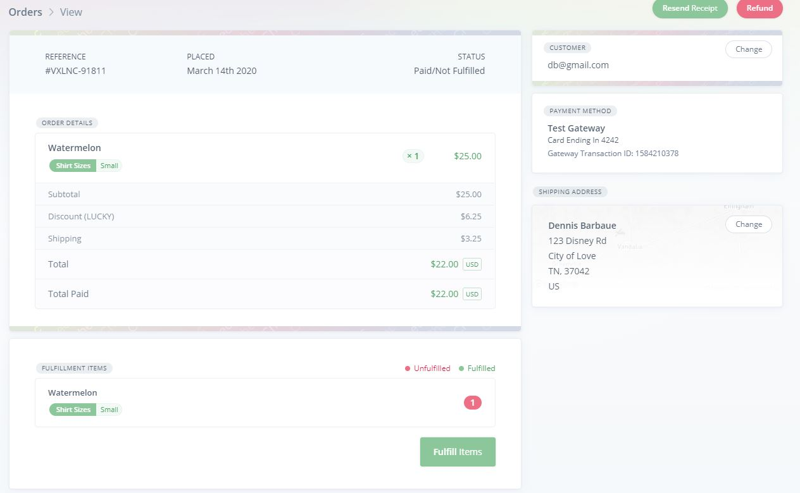

#### Conclusion 

You can now capture orders for your eCommerce website! Hopefully by this point, you can see the benefits of using the Commerce.js SDK and all the helper functions that assist in building the functionality.  In regards to capturing an order, you need to be able to gather all the data necessary - parse that data to match the proper shape needed for the SDK, then capture! Once complete, you'll have the record in your dashboard and can perform any further duties to fulfill the order. Here's a quick summary of what was covered in this guide: 
 
- created a shipping zone and applied the zone to your products
- added a checkout button and setup routes to navigate the site
- generated a checkout token and added it to state
- handling form data which includes validation and errors
- added a discount code option 
- gathering form data and capturing a checkout 

**If you're interesting in implementing stripe as a payment gateway keep reading below ...**


This guide is a continuation of a previous guide:
 - [Adding Products to a Cart](https://github.com/kingmoc/adding-products-cart-cjs-react) - if you're wondering how to even add products to your cart, check out this guide.   

[LIVE DEMO](https://seities-store-cjs-react-guide.netlify.com/)

## Built With

* [React.Js](https://reactjs.org/docs/getting-started.html)
* [Semantic-UI](https://react.semantic-ui.com/)
* [Commerce.js (SDK)](https://commercejs.com/docs/)
* [React Hook Form](https://commercejs.com/docs/)


## *** Extra *** 
### Implementing Stripe

So you've tested your payment gateway and now you want to try using Stripe to process a customer's payment.  Stripe is one of the best third party payment processing platforms available and the Chec dashboard provides Stripe integration.  Just to note, it's not a complete integration in that you still need to connect to Stripe and get an important piece of data (a token) and provide that as apart of your capture.  Let's break it down! 

### Step 1. Get Stripe Acount

This is pretty obvious but you need a personal stripe account in order to use their system.  Head over to [Stripe](https://dashboard.stripe.com/register) and setup an account.  Once your account is created, the most important information needed is your API keys. Stripe has two keys: **Publishable & Secret** - they both come with a *test* version and *live* version.  Make sure to only copy the **TEST** keys in that you do not want to accept live payments during testing.  

<p align="center">
  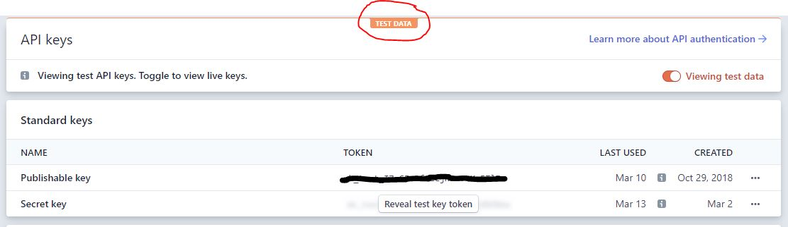
</p>


### Step 2. Enable Payment Gateway in Chec Dashboard

Navigate to your Chec dashboard and in the settings, click **payment gateways**.  Once you're able to see all the different gateway options, enable Stripe. Chec will ask for both publishable and secret keys in order to complete enabling the gateway. 

<p align="center">
  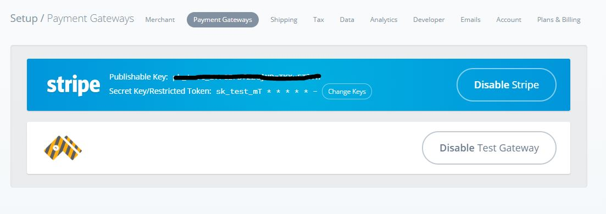
</p>

### Step 3. Create Card Token

This particular step can be done many ways.  The end goal is to [create a card token](https://stripe.com/docs/api/tokens/create_card).  Stripe essentially encapsulates sensitive data into what they call [tokens](https://stripe.com/docs/api/tokens).  These tokens can then be sent to stripe in order to process that information.  

As mentioned creating such tokens can be done a few different ways (such as using Stripe's SDK) - but I'm going to use my Stripe API keys to connect directly to the token endpoint. Once we're able to successfully retrieve a token (which will hold the customer's card information) - I will send that token instead of the card info with the capture ...

#### Axios

I need a way to make an API call and [axios](https://www.npmjs.com/package/axios) is the preferred method.  Because I already know the endpoint I need to access is not open, I built an `axiosWithAuth()` function to hold sensitive data needed to make an API call to Stripe: 

```javascript
// *** axiosWithAuth.js ***
import axios from 'axios'

export const axiosWithAuth = () => {
    const token = process.env.REACT_APP_SECRETKEY_STRIPE

	return axios.create({
        baseURL: 'https://api.stripe.com/v1',
		headers: {
            'Authorization': `Bearer ${token}`,
            'Content-Type':  'application/x-www-form-urlencoded'
        },
	})
}   
```

Stripe uses a ***bearer*** token (*your secret key from Stripe*) and also something else called `application/x-www-form-urlencoded`. This means I won't be able to send `json` objects in the request body.  Don't worry - you an use [this library](https://www.npmjs.com/package/qs) to create the proper formatting for your data.  

Now that I have everything setup: `baseURL`, `token`, and `Content-Type` - let's grab the data needed for Stripe, send it to the proper endpoint, retrieve the token: 

```javascript
// *** CheckoutForm.js ***
let stripInfo = {
    name: `${data.firstname} ${data.lastname}`,
    number: data.number,
    exp_month: data.expiry_month,
    exp_year: data.expiry_year,
    cvc: data.cvc,
    address_zip: data.postal_billing_zip_code
}

axiosWithAuth().post('/tokens', qs.stringify({card: stripInfo}))
    .then(res => {
        console.log(res, 'res from token call')
    }
```

If you recall, I already have the data needed (*from the `data` object*) to create the token.  The property names are slightly different which is why I'm creating a new object `stripInfo`. I'm using the [qs](https://www.npmjs.com/package/qs) library to format the data into `application/x-www-form-urlencoded`.  Stripe requires the data to be nested in the card property.  

I `console.log` the `res` to make sure I'm getting back the information needed.  

```
{
  "id": "tok_1GLg0dL2SfeRK8Enq6gw4peg",
  "object": "token",
  "card": {
    "id": "card_1GLg0dL2SfeRK8EnJ3XQPe8P",
    "object": "card",
    "address_city": null,
    "address_country": null,
    "address_line1": null,
    "address_line1_check": null,
    "address_line2": null,
    "address_state": null,
    "address_zip": null,
    "address_zip_check": null,
    "brand": "Visa",
    "country": "US",
    "cvc_check": null,
    "dynamic_last4": null,
    "exp_month": 8,
    "exp_year": 2021,
    "fingerprint": "m3436v72h7fryyG9",
    "funding": "credit",
    "last4": "4242",
    "metadata": {},
    "name": null,
    "tokenization_method": null
  },
  "client_ip": null,
  "created": 1583977131,
  "livemode": false,
  "type": "card",
  "used": false
}
```

The token id is the first property listed and that is what I will send along with the capture.  

### Step 4. Setting up Stripe logic

Now that I'm offering two different payment methods, I need to reflect that to the user.  I will have two radio buttons that the customer can choose for payment processing.  

<p align="center">
  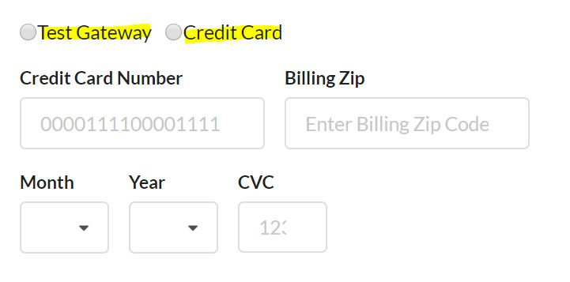
</p>

Based on the `data` object, I know the value of the radio button will be attached to `data.gateway` (*that is the name set for those input types*).  Whichever the customer selects will determine what happens next.  If **Credit Card** is chosen, that means I need to get the token and perform a capture with the token info - same with **Test Gateway**.  

```javascript
// *** CheckoutForm.js ***
if (data.gateway === 'stripe') {

    let stripInfo = {
        name: `${data.firstname} ${data.lastname}`,
        number: data.number,
        exp_month: data.expiry_month,
        exp_year: data.expiry_year,
        cvc: data.cvc,
        address_zip: data.postal_billing_zip_code
    }

    axiosWithAuth().post('/tokens', qs.stringify({card: stripInfo}))
        .then(res => {
            final.payment = {
                gateway: data.gateway,
                card: {
                    token: res.data.id
                }
            }

            if (props.shipOption) {
                // Peform capture with updated payment 'sub-properties'
            }
        })
        .catch(err => {
            console.log(err.data, 'error message')
        })
} else {
    // Perform some other action
}
```

If successful, you update the `payment` object with only the token (***no need for the other data because all the information needed is encapsulated in the token***). Then you just continue as before - if a shipping option is selected, then perform the capture with the updated **`final`** object.  

### Step 5. Capture Checkout

Everything is setup to complete and finalize the customer's order.  I'm getting the token, I've setup the logic, now just complete the checkout.  We can proceed in similar fashion as before in that all I need to do is include the proper **`final`** object depending on which option the customer chooses. 

```javascript
// *** CheckoutForm.js ***
if (props.shipOption) {
    commerce.checkout.capture(props.tokenId, final)
        .then(res => {
                props.setReceipt(res)
                localStorage.removeItem('cart-id')
                history.push(`/order-complete/${props.tokenId}/${res.id}`)
                setProcessing(false)
        })
        .catch(err => {
                window.alert(err.data.error.message)
                setProcessing(false)
        })
}
```

*** *Note *** When using Stripe for testing there are many different card numbers that Stripe suggest using for testing.  For example - **4242424242424242** with any CVC and future expiration date is best for testing.  However if you want to accept cards that require further authentication, there will be more configuration needed.  [Check here for a list of all the different test cards available for Stripe](https://stripe.com/docs/testing)*

Once you've put all the necessary info into the form go ahead and test the Stripe payment gateway.  If successful you can check your Stripe dashboard and confirm the payment went through. 

[LIVE DEMO](https://seities-store-cjs-react-guide.netlify.com/)

<p align="center">
  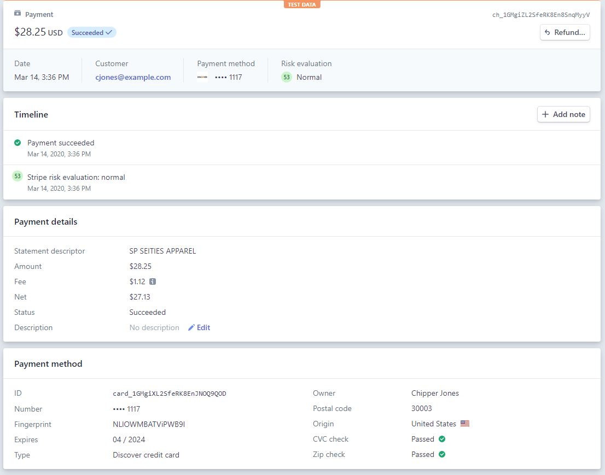
</p>

